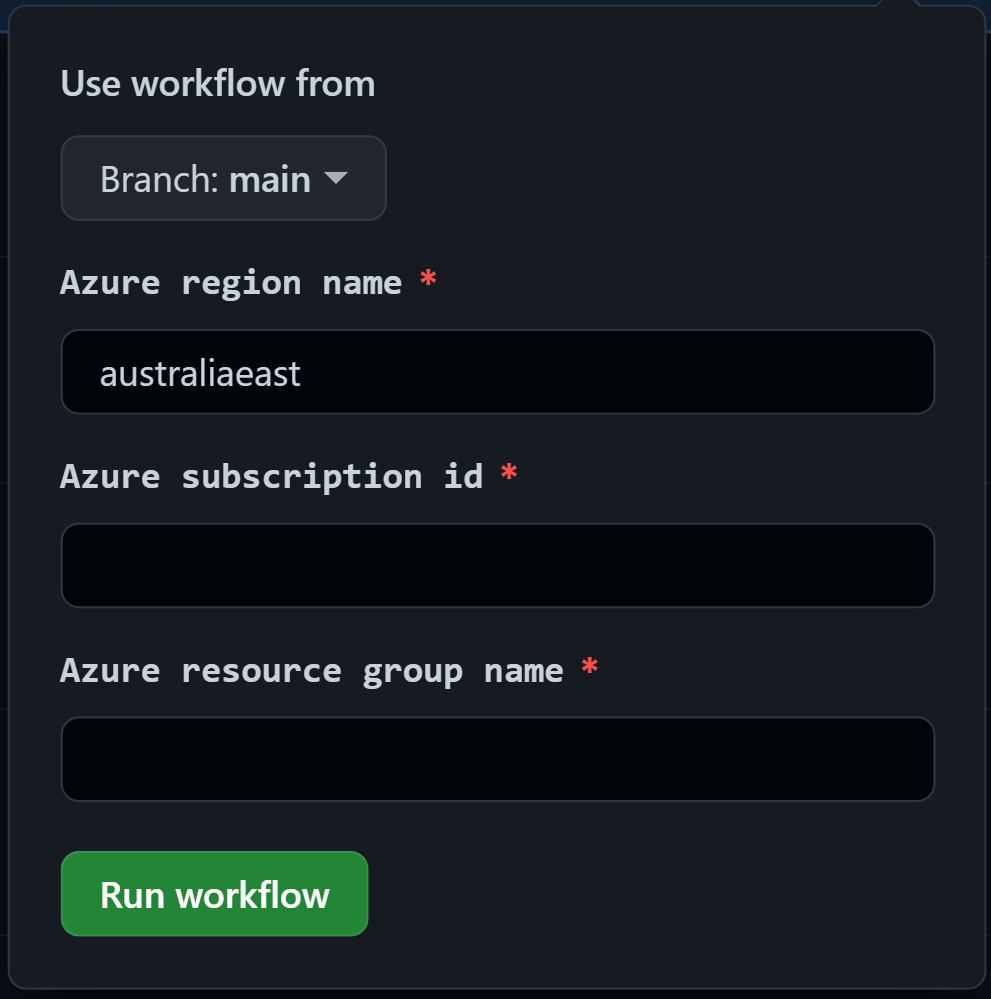

# Azure Nextflow

This repository contains sample only code to demonstrate how secrets can be marshaled from Key Vault into a Container Instance running Nextflow for the purpose of dispatching Nextflow pipelines on Azure Batch.

## Overview

Deploying the Azure resources supporting this sample is left to you.

It is assumed that this infrastructure would be deployed using GitHub workflows and maintained examples are provided. Stale examples for DevOps pipelines are provided but are not working since moving to rust and will not be maintained.

It is assumed that regardless of deployment method, GitHub is used for hosting the forked repository.

## Pre-requisites

1. Fork this repository on GitHub.

1. Install Azure CLI [version 2.45.0](https://learn.microsoft.com/en-us/cli/azure/install-azure-cli-linux?pivots=apt) or newer and login.

    ``` bash
    # Check version
    az --version 

    # Login
    az login

    # Show active subscription
    az account show
    ```

1. Define these variables (change values as needed).

    ``` bash 
    az_subId="xxxxxxxx-xxxx-xxxx-xxxx-xxxxxxxxxxxx"
    az_location="australiaeast"
    az_rgName="GitHubFederatedIdentities"
    az_msiName="GitHubActions"

    gh_org="xxxxxx"          # this repo's org or username
    gh_repo="azure-nextflow" # this repo's name
    ```

1. Create a Resource Group for the Managed Identity.

    ``` bash
    # Create Resource Group
    az group create --name $az_rgName --location $az_location --subscription $az_subId
    ```

1. Create a Managed Identity (user assigned) for GitHub to authenticate with Azure. 

    ``` bash
    # Create MSI
    az identity create --name $az_msiName --resource-group $az_rgName --subscription $az_subId

    # Federate with GitHub
    az identity federated-credential create --name "${gh_org}--${gh_repo}" --identity-name $az_msiName --subject "repo:${gh_org}/${gh_repo}:ref:refs/heads/main" --issuer "https://token.actions.githubusercontent.com" --resource-group $az_rgName --subscription $az_subId 

    # Show details (needed to create the AZURE_MSI GitHub secret)
    az identity show --name $az_msiName --resource-group $az_rgName
    ```

1. Assign ARM permissions to the Managed Identity

    ``` bash
    # Assign ARM permissions
    az role assignment create --assignee $az_msiName --role 'Owner' --scope /subscriptions/$az_subId
    ```    

    > Note: The permissions above are an example, use the least privileged approach when assigning permissions.
        
## Set up

The following uses the provided GitHub workflows to build and deploy the sample.

The deployment is targeted at the subscription level and will create the target resource group if it does not exist. This is why the deployment principal requires permission at the `Subscription` scope.

The deployment creates and assigns permissions to a number of Managed Identities. This is why the deployment principal requires the `Owner` permission.

> Important: As a minimum the deployment principal will require `Contributor` permission on the subscription and `Owner` permission on the target resource group provided the **target resource group** is **created ahead of time**.

### Deploy using GitHub


1. Use the JSON output from the pre-requisite steps to create a new `AZURE_MSI` GitHub Secret, details in [GitHub Docs](https://docs.github.com/en/actions/security-guides/encrypted-secrets).

    **Name**
    ```
    AZURE_MSI
    ```

    **Value**
    ``` json
    {
        "clientId": "xxxxxxxx-xxxx-xxxx-xxxx-xxxxxxxx1111",
        "id": "/subscriptions/xxxxxxxx-xxxx-xxxx-xxxx-xxxxxxxxxxxx/resourcegroups/nxfutil001/providers/Microsoft.ManagedIdentity/userAssignedIdentities/GitHubActions",
        "location": "australiaeast",
        "name": "GitHubActions",
        "principalId": "xxxxxxxx-xxxx-xxxx-xxxx-xxxxxxxx2222",
        "resourceGroup": "GitHubFederatedIdentities",
        "tags": {},
        "tenantId": "xxxxxxxx-xxxx-xxxx-xxxx-xxxxxxxx3333",
        "type": "Microsoft.ManagedIdentity/userAssignedIdentities"
    }
    ```

1. Run the workflow called `GitHub Workflows`.

    

### Validate deployment

To validate set up was successful, trigger the Azure Function using its webhook.

``` bash
az_funcAppName="myFuncAppName"

curl --get "https://$az_funcAppName.azurewebsites.net/api/nxfutil"

# returns
Hello, World!
```

## Usage

### api/nxfutil [GET, POST, DELETE]

When the Function App is triggered it will create a new nxfutil Container Instance. See Annex for nxfutil details.

The http trigger requires a json payload to provide the nextflow job with it's required config, pipeline and parameters files. Provide the URI for each file's location.

> NOTE: providing empty values will trigger a default deployment which uses the nextflow files in this repository.

``` json
{
    "config_uri": "",
    "pipeline_uri": "",
    "parameters_uri": ""
}
```

The http trigger currently accepts 1 (optional) argument.
- A boolean `whatif=true` argument can be provided to perform a mock deployment.

``` bash
az_funcAppName="nxfutil"

curl -X POST "https://$az_funcAppName.azurewebsites.net/api/nxfutil?whatif=true" -H 'Content-Type: application/json' -d '{"config_uri":"", "pipeline_uri":"", "parameters_uri":""}'
```

### api/nxfutil_status [GET, POST]

Progress of the nextflow job can be obtained through `.../api/nxfutil_status`. 

**GET** This will peak at the storage queue and summarize the results. 

> Important: If no process is dequeueing the messages from the storage queue, only the oldest 32 messages can be summarized. 

``` bash
az_funcAppName="myFuncAppName"

curl --get "https://$az_funcAppName.azurewebsites.net/api/nxfutil_status"

# returns
# [
#  {
#   "event": "completed",
#   "runId": "d58d0af4-1373-4dc2-b61d-e8ee06d18849",
#   "runName": "maniac_easley",
#   "utcTime": "2023-02-21T21:42:15Z",
#   "metadata": {
#     "parameters": {
#       "dispatcher": "nextflow-20230220-8010e3cc-130f-4b86-838b-5572e69266d1"
#     },
#     "workflow": {
#       "errorMessage": null,
#       "errorReport": null
#     }
#   }
#  }
# ]
```

**POST** This will retrieve messages with the ability to delete (dequeue) them.


``` bash
az_funcAppName="myFuncAppName"

curl -X POST "https://$az_funcAppName.azurewebsites.net/api/nxfutil_status" -H 'Content-Type: application/json' -d '{"message_count": 1, "dequeue": true}'

# returns verbose message 
```
## Documentation

### [Azure infrastructure](./docs/AzureInfrastructure.md)

### [nxfutil](./docs/nxfutil.md)

### [Azure functions](./azure/functions/rust/README.md)

### [Data upload](./docs/DataUpload.md)

