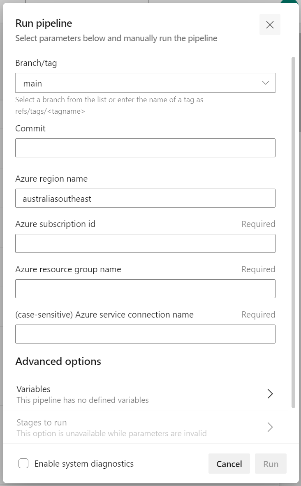

# Azure Nextflow

This repository contains sample only code to demonstrate how secrets can be marshaled from Key Vault into a Container Instance running Nextflow for the purpose of dispatching Nextflow pipelines on Azure Batch.

## Overview

Deploying the Azure resources supporting this sample is left to you.

It is assumed that this infrastructure would be deployed using GitHub workflows or DevOps pipelines; samples of each are provided.

It is assumed that regardless of deployment method, GitHub is used for hosting the forked repository.

## Pre-requisites

1. Fork this repository on GitHub.

1. Create a Service Principal for connecting to Azure. 

    ``` bash
    az_subId="xxxxxxxx-xxxx-xxxx-xxxx-xxxxxxxxxxxx"

    az ad sp create-for-rbac --name "DeploymentConnection" --role owner --scopes /subscriptions/$az_subId--sdk-auth
    ```

1. (optional) Access can be granted at the resource group scope instead of the subscription scope if the resource group is created before running the deployment workflow/pipeline.
    
    ``` bash
    az_subId="xxxxxxxx-xxxx-xxxx-xxxx-xxxxxxxxxxxx"
    az_rgName="myRgName"

    az ad sp create-for-rbac --name "GitHubConnection" --role owner --scopes /subscriptions/$az_subId/resourceGroups/$az_rgName --sdk-auth
    ```

    > Important: The principal will need Owner permission on the target resource group scope as a minimum.

## Set up 

The following uses the provided GitHub workflows or DevOps pipelines to build and deploy the sample. See Annex below for manual set up instructions.

### Deploy using GitHub


1. Create a new `AZURE_CREDENTIALS` GitHub Secret using the Service Principal created earlier; details in [Azure Docs](https://docs.microsoft.com/en-us/azure/developer/github/connect-from-azure?tabs=azure-cli%2Cwindows#create-a-service-principal-and-add-it-as-a-github-secret).

1. Run the workflow called `GitHub Workflows`.

    

### Deploy using DevOps 


1. Create a new `Azure Resource Manager - Service principal (manual)` Service Connection in DevOps using the Service Principal created earlier; details in [Azure Docs](https://docs.microsoft.com/en-us/azure/devops/pipelines/library/connect-to-azure?view=azure-devops#create-an-azure-resource-manager-service-connection-with-an-existing-service-principal).

1. Creating a new pipeline and link to the `./.devops/pipelines/cicd.yml` file that's on GitHub by selecting `GitHub (YAML)` and then `Existing Azure Pipelines YAML file`.

1. Run the newly created pipeline.

    > Important: The Service Connection parameter is case-sensitive.

    

### Validate deployment

To validate set up was successful, trigger the Azure Function using its webhook.

``` bash
az_funcAppName="myFuncAppName"

curl --get "https://$az_funcAppName.azurewebsites.net/api/nxfutil"

# returns
Successfully created nxfutil container instance nextflow-xxxxxx.
```

## Usage

When the Function App is triggered it will create a new nxfutil Container Instance. See Annex for nxfutil details.

The http trigger currently accepts 3 (optional) arguments.
- A URI to a Nextflow `config` file. 
- A URI to a Nextflow `pipeline` file.
- A URI to a Nextflow `parameters` file.

``` bash
az_funcAppName="nxfutil-py"

nxf_configUri="https://raw.githubusercontent.com/axgonz/azure-nextflow/main/nextflow/pipelines/nextflow.config"
nxf_pipelineUri="https://raw.githubusercontent.com/axgonz/azure-nextflow/main/nextflow/pipelines/helloWorld/pipeline.nf"
nxf_parametersUri="https://raw.githubusercontent.com/axgonz/azure-nextflow/main/nextflow/pipelines/helloWorld/parameters.json"

curl --get "https://$az_funcAppName.azurewebsites.net/api/nxfutil?config=$nxf_configUri&pipeline=$nxf_pipelineUri&parameters=$nxf_parametersUri"
```

## Annex

### [Azure infrastructure](./docs/AzureInfrastructure.md)

### [nxfutil](./docs/nxfutil.md)

### [Azure functions](./azure/functions/python/README.md)

### [Data upload](./docs/DataUpload.md)

### [Manual set up (depreciated)](./docs/ManualSetup.md)
